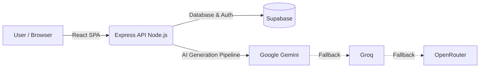

<div align="center">
  
  <h1>StudioOS</h1>
  <p><strong>An elite AI-powered Product Operating System Generator</strong></p>
  
  [](https://opensource.org/licenses/MIT)
  [](https://react.dev/)
  [](https://www.typescriptlang.org/)
  [](https://supabase.com/)
  [](#)
</div>

<br />

## 📖 Project Overview

**StudioOS** is an intelligent, elite Product Operating System Generator designed for founders, architects, and engineering leads. It bridges the gap between raw product ideas and executable engineering reality. 

By analyzing a simple product description and target audience, StudioOS leverages a highly available **multi-model AI pipeline** (featuring Google Gemini, Groq, and OpenRouter) to instantly generate a comprehensive, rigorous, and executable "Product OS." This eliminates vague buzzwords and provides concrete deliverables, custom team role allocations, actionable risk mitigations, a positioned strategy matrix, and high-quality AI handover prompts.

---

## ✨ Features

StudioOS is built for production, prioritizing performance, reliability, and modern UX:

- **🤖 Multi-Model AI Engine**: High-availability AI generation utilizing a cascading fallback system across Google Gemini, Groq, and OpenRouter to ensure your requests always succeed.
- **🔐 Secure Authentication**: Integrated authentication with Supabase, including robust Google Sign-In support.
- **📊 Project Dashboard**: A centralized workspace to view, search, and manage all your generated Product Operating Systems.
- **✏️ Deep Project Editing**: Fully interactive editors for Strategy, Team Identity, Workflows, Deliverables, Quality Gates, and AI Handoffs.
- **☁️ Cloud Synchronization**: Seamless data persistence using Supabase PostgreSQL.
- **📱 Cross-Device Support**: Atomic, responsive UI that works flawlessly from desktop workstations to mobile devices.
- **🌓 Adaptive Theming**: Beautiful Dark and Light modes using modern CSS variables.
- **✨ Modern UI & Animations**: Premium aesthetics powered by Tailwind CSS and Framer Motion.
- **⏳ Graceful Loading States**: Skeleton loaders and optimistic UI updates for a snappy experience.
- **🛡️ Robust Error Handling**: Comprehensive fallbacks for API timeouts, network failures, and parsing errors.

---

## 🛠️ Tech Stack

StudioOS utilizes a full-stack TypeScript architecture, optimized for speed and developer experience.

| Category | Technology |
| --- | --- |
| **Frontend** | React 19, Vite, Tailwind CSS v4, Framer Motion, Lucide React |
| **Backend** | Node.js, Express, `tsx` (Dev), `esbuild` (Prod) |
| **Database** | PostgreSQL (via Supabase) |
| **Authentication** | Supabase Auth (Email + Google OAuth) |
| **AI Providers** | Google Gemini (`@google/genai`), Groq, OpenRouter |
| **Language** | TypeScript |
| **Deployment** | GitHub, Render (Web Service), Supabase |

---

## 🏗️ Architecture

The application follows a clean, decoupled client-server architecture with an integrated API proxy layer to avoid CORS issues and protect secrets.



1. **Client**: The React frontend handles all user interactions, UI state, and animations.
2. **Backend**: An Express server serves the static Vite frontend in production and acts as a secure API gateway.
3. **Data Layer**: Supabase manages session tokens securely and serves as the persistent PostgreSQL datastore.
4. **AI Engine**: The backend orchestrates requests to Google Gemini, with robust fallbacks to Groq and OpenRouter if the primary provider fails, ensuring uninterrupted generation of complex JSON structures.

---

## 🚀 Installation & Local Development

### 1. Clone the repository
```bash
git clone https://github.com/yourusername/studioos.git
cd studioos
```

### 2. Install dependencies
```bash
npm install
```

### 3. Configure Environment Variables
Create a `.env` file in the root directory (see [Environment Variables](#-environment-variables) section below).

### 4. Start Development Server
This will start both the Express API and the Vite frontend proxy simultaneously using `tsx`.
```bash
npm run dev
```
The app will be available at `http://localhost:3000`.

### 5. Production Build
To bundle the frontend with Vite and the backend with esbuild:
```bash
npm run build
npm start
```

---

## 🔐 Environment Variables

Create a `.env` file in the root of your project. **Never commit this file to version control.**

```env
# AI Providers (Cascading Fallback System)
GEMINI_API_KEY="your_gemini_api_key_here"
GROQ_API_KEY="your_groq_api_key_here"
OPENROUTER_API_KEY="your_openrouter_api_key_here"

# Supabase Configuration
VITE_SUPABASE_URL="https://your-project-id.supabase.co"
VITE_SUPABASE_ANON_KEY="your_supabase_anon_key_here"

# Node Environment
NODE_ENV="development" # Set to "production" in deployment
PORT=3000
```

---

## 📁 Project Structure

```text
studioos/
├── server.ts              # Express API (including AI multi-model fallbacks)
├── package.json           # Dependencies and Build Scripts
├── .env                   # Secrets (Not tracked)
└── src/                   # React Frontend Source
    ├── main.tsx           # React Entry Point
    ├── App.tsx            # Main Application Component & Router
    ├── index.css          # Tailwind & Global Styles
    ├── types.ts           # Global TypeScript Interfaces
    ├── data.ts            # Seed Data & Legacy Storage
    ├── components/        # Reusable UI Components
    ├── contexts/          # React Context Providers
    └── pages/             # Route Views (Dashboard, EditProject, etc.)
```

---

## 📸 Screenshots

| Landing Page | Dashboard |
|:---:|:---:|
|  |  |

| Project Workspace | Mobile View |
|:---:|:---:|
|  |  |

> **Note on adding your own screenshots**: 
> 1. Create a `screenshots` folder in the root of the project.
> 2. Place your image files there (e.g., `landing.png`).
> 3. Replace the `https://via.placeholder.com/...` URLs in the markdown table above with the relative path to your images (e.g., `./screenshots/landing.png`).

---

## 🛣️ Roadmap: Future Improvements

StudioOS is continuously evolving. Planned upcoming features include:

- [ ] **Hide/Archive Projects**: Keep the active dashboard clean without permanently deleting historical OS configurations.
- [ ] **Team Collaboration**: Invite team members to view, comment on, and edit specific Product OS instances.
- [ ] **Export Features**: Export generated workflows and deliverables to PDF, Markdown, or directly to issue trackers like Linear/Jira.
- [ ] **Notifications**: Real-time alerts for collaborative edits and background AI generation completion.
- [ ] **Version History**: Track structural changes and roll back to previous iterations of a project configuration.
- [ ] **AI Workflow Automation**: Automatically generate follow-up tickets and pull request templates from Deliverable steps.

---

## ☁️ Deployment

StudioOS is designed to be easily deployable on modern cloud infrastructure:

1. **Source Control**: Managed via **GitHub**.
2. **Backend & Frontend Host**: Deployed as a single unified Node.js Web Service on **Render**. The deployment executes `npm run build` and runs `npm start`.
3. **Database & Auth**: Hosted externally via managed **Supabase**.

---

## 📄 License

This project is licensed under the **MIT License**. See the `LICENSE` file for more details.

---

<div align="center">
  <i>Engineered with precision. Built for scale.</i>
</div>
